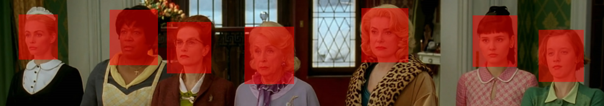
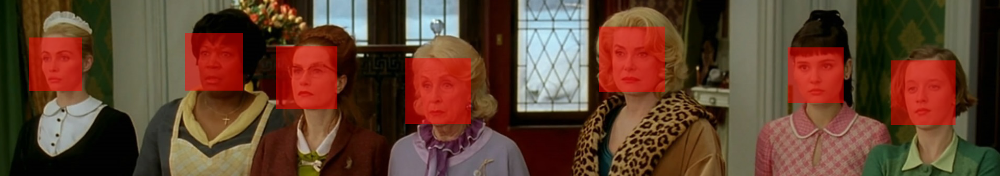
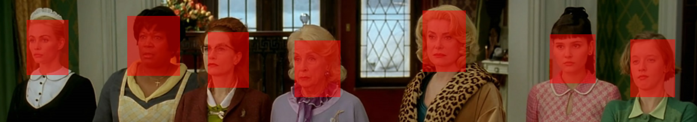

# Face Detection with Fovea

Fovea reports the bounding box for each detected face in a four field format, described below. These bounding boxes can be easily plotted over the original image, with ImageMagick, for instance.

  1. Left-X 
  2. Top-Y
  3. Width
  4. Height

Google: `[user@host]$ fovea --google --faces 7.png`

Microsoft: `[user@host]$ fovea --microsoft --faces 7.png`

OpenCV: `[user@host]$ fovea --opencv --faces 7.png`

Amazon: `[user@host]$ fovea --amazon --faces 7.png`

Clarifai: `[user@host]$ fovea --clarifai --faces 7.png`

Watson: `[user@host]$ fovea --watson --faces 7.png`

SightHound `[user@host]$ fovea --sighthound --faces 7.png`

Face++ `[user@host]$ fovea --face++ --faces 7.png`

