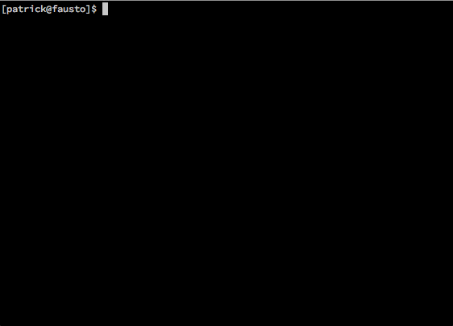

# Fovea

Fovea is a unified command-line interface to computer vision APIs from [Google](https://cloud.google.com/vision/docs/), [Microsoft](https://www.microsoft.com/cognitive-services/en-us/computer-vision-api), [AWS](https://aws.amazon.com/rekognition/), [Clarifai](https://developer.clarifai.com/), [Imagga](https://wwww.imagga.com/), and [IBM Watson](https://www.ibm.com/watson/developercloud/visual-recognition.html). Use Fovea if you want to:

1.	Easily classify images in a shell script.
2.	Compare alternative computer vision apis.

<p align=center>

</p>

The table below characterizes Fovea's current feature coverage. Most vendors offer broadly similar features, but their output formats differ. Where possible, Fovea uses a tabular output mode suitable for interactive shell sessions, and scripts. If a particular feature is not supported by this tabular output mode, vendor-specific JSON is available, instead. 

| Feature               | Google | Microsoft | Amazon | Clarifai | Watson | Imagga |OpenCV | Tabular   |  JSON |
| ---:                  |  ---   | ---       | ---    | ---      | ---    | ---    |---    |  ---      | ---  |
| [Labels](#labels) | ✅️️     | ✅    ️️   | ✅️️     |  ✅      |  ✅   | ✅       |        | ✅         ️️| ✅    ️️|
| [Label i18n](#label-i18n)    |        | ✅       |        | ✅        | ✅    | ✅       |        | ✅          | ✅      |
| [Faces](#faces)                 | ✅️️     | ✅️️       | ✅️️     |  ✅      |  ✅   |        | ✅️️     | ✅️️         | ✅️️    |
| [Landmarks](#landmarks)             | ✅     |          |        |          |        |        |        | ✅️️         | ✅️    ️|
| [Text (OCR)](#ocr)            | ✅     | ✅️️️       |        |          |        |        |        | ️️❌          | ✅️️    |
| [Emotions](#emotions)              | ✅️️     | ✅️️       | ❌️     |          |       |        |         | ❌          | ✅️️    |
| [Description](#description)           |        | ✅️️       |        |          |        |        |         | ❌          | ✅️️    |
| [Adult (NSFW)](#adult)          | ✅     | ✅️️       |        | ✅️️       |        | ❌        |         | ✅️️          | ✅️️    | 
| [Categories](#categories)            |        | ✅️️       |        |          | ✅️️     |        |         | ✅️️          | ✅️️    |
| [Image Type](#image-type)            |        | ✅️       |        |          |        |        |         | ❌          | ✅️    ️|
| [Color](#color)                 |        | ✅️️       |        | ❌       |        | ❌       |         | ❌          | ✅️️    |
| [Celebrities](#celebrities)           |        | ✅       |        | ✅️       | ✅     |        |         | ✅️          | ✅      |
✅ indicates a working feature, ❌ indicates a missing feature, and empty-cells represent features not supported by a particular vendor.

## Installation and Setup

Clone the Fovea repository, install its dependencies, and source its environment script.

````bash
[user@host]$ git clone https://github.com/28mm/Fovea.git
[user@host]$ cd Fovea
[user@host]$ pip3 install -r requirements.txt
[user@host]$ source fovea-env.sh 
`````

Obtain credentials for the web services you plan to use. These should be supplied to Fovea via environment variables. See `fovea-env.sh` for a template.

 * Google Cloud Vision API: [https://cloud.google.com/vision/docs/](https://cloud.google.com/vision/docs/)
 * Microsoft Computer Vision API: [https://www.microsoft.com/cognitive-services/en-us/computer-vision-api](https://www.microsoft.com/cognitive-services/en-us/computer-vision-api)
 * Amazon Web Services Rekognition: [https://aws.amazon.com/rekognition/](https://aws.amazon.com/rekognition/)
 * IBM Watson Image Recognition: [https://www.ibm.com/watson/developercloud/visual-recognition.html](https://www.ibm.com/watson/developercloud/visual-recognition.html)
 * Clarifai: [https://developer.clarifai.com/](https://developer.clarifai.com/)
 * Imagga: [https://docs.imagga.com](https://docs.imagga.com)


````bash
export GOOG_CV_KEY=""
export MSFT_CV_KEY=""
export AWS_CV_KEY_ID=""
export AWS_CV_KEY_SECRET=""
export AWS_CV_REGION=""
export CLARIFAI_CLIENT_ID=""
export CLARIFAI_CLIENT_SECRET=""
export CLARIFAI_ACCESS_TOKEN=""
export WATSON_CV_URL=""
export WATSON_CV_KEY=""
export IMAGGA_ID=""
export IMAGGA_SECRET=""
````

## Usage
````bash
usage: fovea [-h]
             [--provider {google,microsoft,amazon,opencv,watson,clarifai,imagga,facebook}]
             [--output {tabular,json,yaml}] [--lang LANG]
             [--ocr-lang OCR_LANG] [--max-labels MAX_LABELS]
             [--precision PRECISION] [--labels] [--faces] [--text]
             [--emotions] [--description] [--celebrities] [--adult]
             [--categories] [--image_type] [--color] [--landmarks]
             [--confidence confidence threshold] [--model MODELS]
             [--list-models] [--list-langs] [--list-ocr-langs]
             [files [files ...]]

Classify image contents with the the Google, Microsoft, or Amazon Computer
Vision APIs.

positional arguments:
  files

optional arguments:
  -h, --help            show this help message and exit
  --provider {google,microsoft,amazon,opencv,watson,clarifai,imagga,facebook}
  --output {tabular,json,yaml}
  --lang LANG
  --ocr-lang OCR_LANG
  --max-labels MAX_LABELS
  --precision PRECISION
  --labels
  --faces
  --text
  --emotions
  --description
  --celebrities
  --adult
  --categories
  --image_type
  --color
  --landmarks
  --confidence confidence threshold
  --model MODELS
  --list-models
  --list-langs
  --list-ocr-langs
````

### Labels

If no other flags are set, `--labels` is set by default, and `--provider` is set to `google`. `fovea <file> [files...]`

````bash
[user@host]$ fovea http://omp.gso.uri.edu/ompweb/doee/biota/inverts/cten/pleur.jpg
0.76	biology
0.72	organism
0.61	invertebrate
0.50	deep sea fish
````

The provider argument make it possible to use a different API. `fovea --provider <provider> --labels <file> [files ...]`

````bash
fovea --provider clarifai http://omp.gso.uri.edu/ompweb/doee/biota/inverts/cten/pleur.jpg
0.99	invertebrate
0.99	science
0.96	no person
0.96	desktop
0.95	biology
[...snip...]
````

### Label i18n

Several providers offer label translations, and all default to English (en). Learn which languages a given provider supports with the list `--list-langs` flag.

````bash
[user@host]$ fovea --provider microsoft --list-langs
en
zh
````

From the list of vendor-supported languages, set the desired language with the `--lang` argument.

````bash
[user@host]$ fovea http://omp.gso.uri.edu/ompweb/doee/biota/inverts/cten/pleur.jpg --provider clarifai --lang ar
0.99	لافقاريات
0.99	العلوم
0.96	لا يجوز لأي شخص
0.96	خلفية حاسوب
0.95	علم الاحياء
0.95	استكشاف
````

### Faces

Most vendors support face detection. Setting the `--face` flag will return a newline-separated list of bounding boxes. Bounding boxes are represented as four values: (left-x, top-y, width, height).

````bash
[useer@host]$ fovea --provider amazon --faces examples/face-detection/7.png
1145	51	125	125
775	112	125	125
1703	116	123	123
528	89	116	119
354	63	110	110
1506	91	106	106
55	72	101	102
````

### Landmarks

At present, only Google supports landmark and location detection. 

````bash
[user@host]$ fovea --landmarks ../ex/rattlesnake-ledge.jpg
0.35	Rattlesnake Lake	47.436158,-121.77812576293945
````

### OCR

OCR is only supported in the JSON output mode, and its format is vendor specific.

### Emotions

Emotion detection is only supported in the JSON output mode, and its format is vendor specific.

### Description

Scene descriptions are only available in the JSON output mode, and its format is vendor specific.

### Adult

The parameters for NSFW and Adult image detection vary a bit between vendors. The values for Google are fudged from likelihoods (VERY_LIKELY, LIKELY, VERY_UNLIKELY) to numeric values (0.01, 0.25, 0.50, 0.75, 0.99), in order to follow the convention established by other services.

```bash
[user@host]$ fovea --adult --provider google test.jpg
0.25	nsfw

[user@host]$ fovea --adult --provider clarifai test.jpg
0.99	sfw
0.01	nsfw

[user@host]$ fovea --adult --provider microsoft test.jpg
0.13	nsfw
0.07	racy
````

### Categories

Categoriziation is only available in the JSON output mode, and its format is vendor specific.

### Image Type

Image type detection is only available in the JSON output mode, and its format is vendor specific.

### Color

Dominant color detection is only available in the JSON output mode, and its format is vendor specific.

### Celebrities

Celebrity detection is supported by Microsoft, Watson, and Clarifai.

````bash
[user@host]$ fovea --celebrities 'https://timedotcom.files.wordpress.com/2016/08/barack-obama-michelle-obama-love-story-romance-photos-08.jpg?w=1200&quality=85&h=800' --provider microsoft
432 134 148 148 0.95    xxxxx   Barack Hussein Obama
279 191 117 117 1.00    xxxxx   Michelle Obama
````


