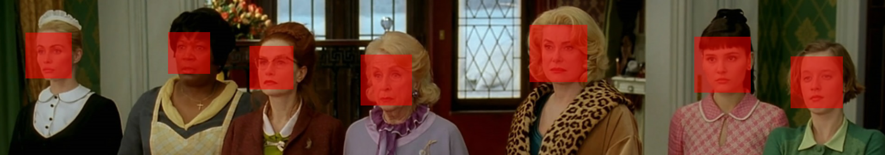
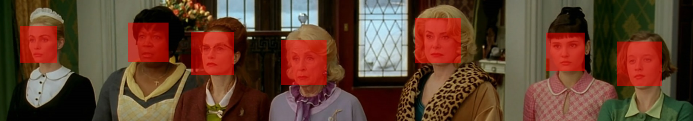
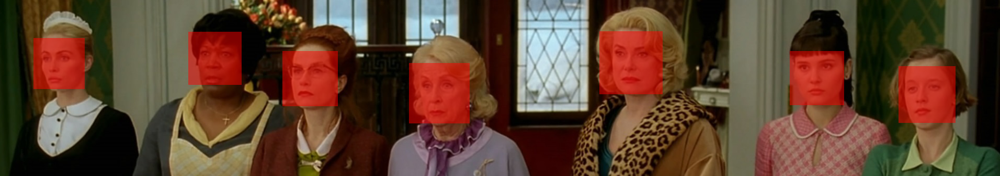

# Fovea

`fo·ve·a: A small depression in the retina of the eye where visual acuity is highest. The center of the field of vision is focused in this region, where retinal cones are particularly concentrated.`

## Introduction

Fovea provides a unified command line interface to computer vision APIs from , , , , and . Use Fovea if you want to:

1.	Easily classify images in a shell script. See: [examples](#examples).
2.	Compare the functionality or acuity of alternative computer vision apis.

Fovea provides a standardized tabular output mode, suitable for interactive shell sessions or scripts. Where Fovea's simplified tabular output is inadequate, use its json output mode to get vendor-specific json, instead. The table below attempts to characterize the current status of Fovea's feature coverage. 

| Feature      | Google | Microsoft | Amazon | Clarifai | Watson | OpenCV | Tabular   | JSON |
| ---:         |  ---   | ---       | ---    | ---      | ---    | ---    |  ---      | ---  |
| Labels       | ✅️️      | ✅    ️️     | ✅️️      |  ✅       |  ✅     |        | ✅         ️️| ✅    ️️|
| Faces        | ✅️️      | ✅️️         | ✅️️      |  ✅       |  ✅     | ✅️️      | ✅️️         | ✅️️    |
| Landmarks    | ✅      ️|           |        |          |        |        | ✅️️         | ✅️    ️|
| Text (OCR)   | ✅      | ✅️️️         |        |          |        |        | ️️❌          | ✅️️    |
| Emotions     | ✅️️      | ✅️️         | ❌️      |          |        |        | ❌          | ✅️️    |
| Description  |        | ✅️️         |        |          |        |        | ❌          | ✅️️    |
| Adult (NSFW) | ✅     | ✅️️         |        | ✅️️       |        |        | ✅️️          | ✅️️    | 
| Categories   |        | ✅️️         |        |          | ✅️️       |        | ✅️️          | ✅️️    |
| Image Type   |        | ✅️         |        |          |        |        | ❌          | ✅️    ️|
| Color        |        | ✅️️         |        | ❌       |        |        | ❌          | ✅️️    |
| Celebrities  |        | ✅         |        |          | ✅     |        | ❌          | ✅      |

## Installation and Setup

Clone the Fovea repository, install its dependencies, and source its environment script.

````bash
[user@host]$ git clone https://github.com/28mm/Fovea.git
[user@host]$ cd Fovea
[user@host]$ pip3 install -r requirements.txt
[user@host]$ source fovea-env.sh 
`````

Credentials are required to use web services from most providers. Most offer a rate-limited free tier for trial or low-volume users. Refer to the links below to obtain the needed credentials.

 * Google Cloud Vision API: 
 * Microsoft Computer Vision API: 
 * Amazon Web Services Rekognition: 
 * IBM Watson Image Recognition: 
 * Clarifai: 

Credentials should be supplied to Fovea via environment variables. See `fovea-env.sh` for a template.

````bash
export GOOG_CV_KEY=""
export MSFT_CV_KEY=""
export AWS_CV_KEY_ID=""
export AWS_CV_KEY_SECRET=""
export AWS_CV_REGION=""
export CLARIFAI_CLIENT_ID=""
export CLARIFAI_CLIENT_SECRET=""
export CLARIFAI_ACCESS_TOKEN=""
export WATSON_CV_URL=""
export WATSON_CV_KEY=""
````

## Usage
````bash
usage: fovea [-h]
             [--provider {google,microsoft,amazon,opencv,watson,clarifai}]
             [--output {tabular,json,yaml}] [--labels] [--faces] [--text]
             [--emotions] [--description] [--celebrities] [--adult]
             [--categories] [--image_type] [--color] [--landmarks]
             [--confidence confidence threshold]
             files [files ...]
````

## Examples

 1. [Face Detection](#face-detection)
 1. [Instagram](#instagram)
  
### Face Detection

In the example below (a still from the François Ozon film *8 femmes*), ImageMagick is used to draw a bounding box around the faces detected by six services. See `.../examples/face-detection` in the distribution directory for further details.

The Google API returns better-centered and more inclusive bounding-boxes than those from any competing services. Others are cropped more radically to include only facial features. All of the services, including the free-to-use OpenCV Haar Cascade, find all seven faces.

Google: `[user@host]$ fovea --provider google --faces file.png`


Microsoft: `[user@host]$ fovea --provider microsoft --faces file.png`


OpenCV: `[user@host]$ fovea --provider opencv --faces file.png`


Amazon: `[user@host]$ fovea --provider amazon --faces file.png`


Clarifai: `[user@host]$ fovea --provider clarifai --faces file.png`


Watson: `[user@host]$ fovea --provider watson --faces file.png`


### Instagram

Instagram is an interesting source of example data. Accounts are often thematic, as are hashtags. Below are the top 20 labels applied to 400 images drawn from the  Instagram account. 

````bash
[user@host]$ for provider in google microsoft amazon
> do
>     fovea --labels --provider $provider *.jpg | sed 's/0\.[0-9]*[[:space:]]*//g' | sort | uniq -c | sort -n | tail -20 > labels.$provider
> done
````

The providers mostly agree with respect to broad categories--Person is the most frequent label in all cases--but differ regarding more specific features. For example, the Google API applies numerous *hair* related labels: *hair*, *hairstyle*, *black hair* , *long hair*, and *brown hair*. The Microsoft API applies *hair*, and *hairpiece* only, and Amazon turns up ten or so *Chairs*.


| Google              | Amazon     | Microsoft | Clarifai | Watson |
| :---              | :---         | :---         | :--- |  :---   |
|   39 nose |   43 Maillot |   11 hair |   75 brunette | 22 overgarment |
|   39 spring |   45 Crowd |   12 water | 95 love  | 23 young lady (heroine) |
|   40 brown hair |   47 Accessories |   13 ground | 96 recreation | 24 entertainer | 
|   42 face |   48 Head |   14 black |  102 group | 25 room |
|   42 long hair |   59 Smile |   14 floor | 109 glamour | 25 sweetheart |
|   50 lady |   60 Lingerie |   14 nature |  110 sexy | 26 alizarine red color |
|   51 leg |   61 Bra |   15 dressed |  113 dress | 26 sister |
|   55 supermodel |   62 Underwear |   16 crowd |  113 indoors |  28 maroon color |
|   56 black hair |   66 Dress |   18 man |  116 music | 28 undergarment |
|   57 model |   70 Girl |   24 beautiful |  118 facial expression | 34 Indian red color |
|   61 photo shoot |   82 Costume |   30 sky |  124 two | 37 dress |
|   64 hairstyle |   86 Apparel |   30 standing |  152 man | 43 device |
|   64 photograph |  108 Woman |   35 clothing |  163 model | 51 gray color |
|   66 dress |  128 Face |   36 group |  169 one | 52 black color |
|   71 hair |  139 Clothing |   52 wall |  210 girl | 60 ivory color |
|   76 photography |  170 Portrait |   53 people |  221 fashion | 75 female |
|   96 image |  199 Selfie |   81 outdoor |  263 wear | 83 people |
|  103 beauty |  231 Female |   90 woman |  293 portrait | 94 woman |
|  103 clothing |  342 Human |  124 posing |  318 adult | 95 garment |
|  115 fashion |  344 People |  137 indoor |  337 woman | 139 coal black color |
|  124 person |  353 Person |  302 person | 352 people | 261 person |


